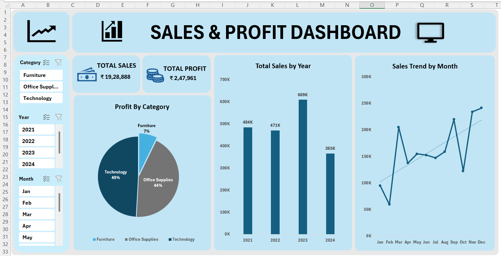

# SCT_DA_Task1
**Sales & Profit Dashboard**
**Overview**

This project is an interactive Excel Sales & Profit Dashboard created to analyze business performance using sales data. The dashboard provides key insights into total sales, total profit, category-wise profit distribution, yearly sales performance, and monthly sales trends.

**Features**
Total Sales and Total Profit KPIs
Profit Analysis by Category
Year-wise Sales Comparison
Monthly Sales Trend Analysis
Interactive Slicers for Category, Year, and Month Filtering
Clean and User-Friendly Dashboard Design

**Tools Used**
Microsoft Excel
Pivot Tables
Pivot Charts
Slicers
Conditional Formatting

**Dashboard Insights**
Technology category contributes the highest profit.
Sales reached their peak in 2023.
Monthly sales trends help identify high and low-performing periods.
Interactive filters allow dynamic data exploration.

## Project Screenshot

